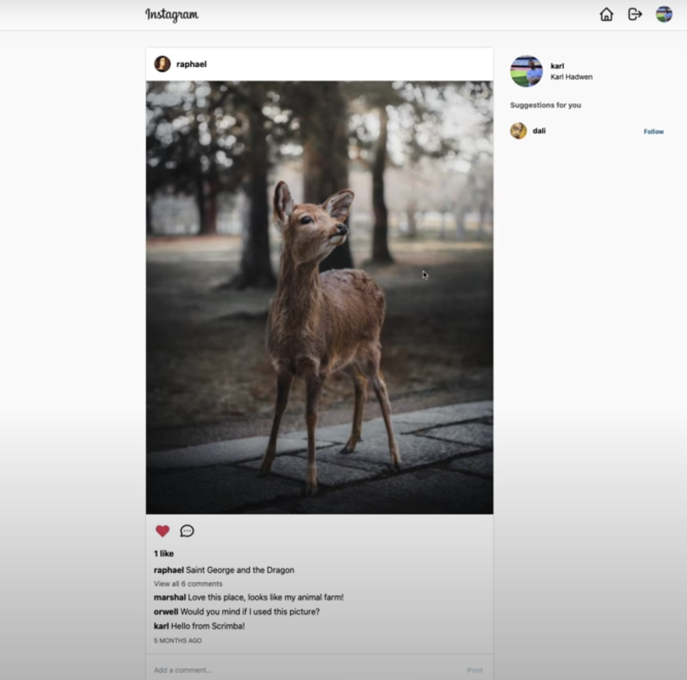

# instagram_Clone

### _This application is a (very basic) clone of Instagram built with React, Tailwind CSS and Firebase. I don't anticipate finishing until 6/15, so please check back!_

This project uses React (custom hooks, useContext, useState, useEffect, useRef), Firebase (Firestore/auth), Tailwind CSS, LoadTest, Lighthouse, Vercel, React Testing Library and Cypress E2E Testing.

This project has multiple pages: Login, Sign Up, Dashboard (to view/like/comment on photos), and User Profiles. The sign-in page connects to Firebase when a user tries to sign in, and when a user signs up, Firebase Auth is used to store the user in the Firebase Auth Database. 

## Table of Contents

- [Media](#Media)

- [Deployed Site](#deployed-site)

- [Contributors](#Contributors)

- [Contact](#Contact)

- [Project Status](#project-status)

- [License](#License)

## Media

Login Page Example:
  

Homepage Example:

## Deployed Site

[I am still working on this project. In the meantime, click to check out my other repositories.](https://github.com/celestealexmoore?tab=repositories)

## Contributors

This application was created by Celeste Moore.

## Contact

If you have any questions about this repository, contact celestealexmoore via GitHub or reach out via email:
celestealexmoore@gmail.com.

## Project Status

In progress

---

## License

© 2021 _celestealexmoore_